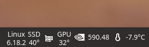

# Simple STDOUT

[](https://opensource.org/licenses/MIT)

Simple Plasma 6 STDOUT output widget 

<p align="center">
  
</p>

## Examples

```
echo -e "Linux\n$(uname -r | cut -c 1-6)"
echo -e "SSD\n$(sensors | grep -A 2 'nvme-pci-0500' | grep 'Composite' | cut -d '+' -f2 | cut -c 1-2)°"
echo -e "GPU\n$(nvidia-smi --query-gpu=temperature.gpu --format=csv,noheader,nounits)°"
nvidia-smi --query-gpu=driver_version --format=csv,noheader | cut -c 1-6
weather-Cli get Saratov | grep Temperature | awk "{print \$2}"
...
```

## Install

```
cd ~/.local/share/plasma/plasmoids
git clone https://github.com/varlesh/org.kde.simple.stdout
```
